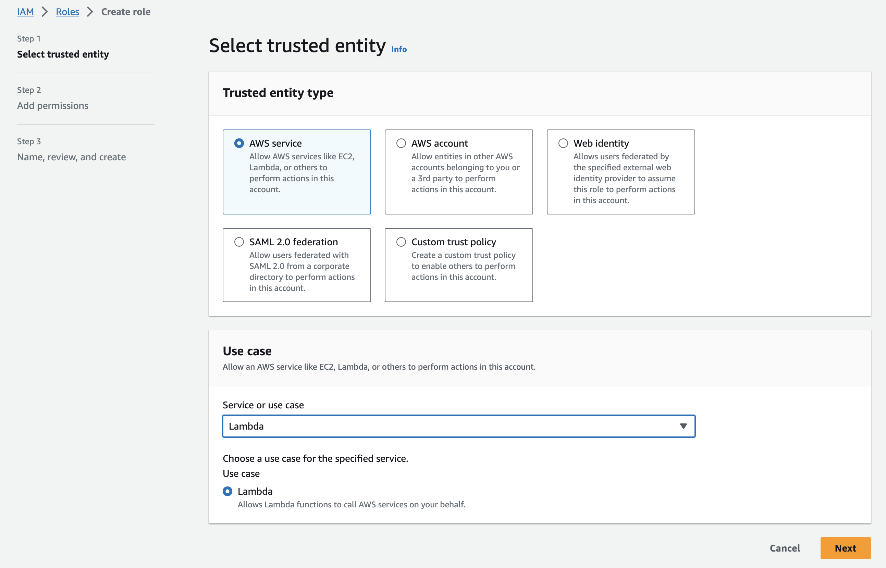

# AWS Specific Notes

## Number of routes and integration limit

The AWS API Gateway has limits on how many routes/integrations can be added to 1 API:

https://docs.aws.amazon.com/apigateway/latest/developerguide/limits.html#api-gateway-limits:

Resource or operation | Default quota | Can be increased
-- | -- | --
Routes per API | 300 | Yes
Integrations per API | 300 | No
Maximum integration timeout | 30 seconds | No

Using the _naive_ approach to create a route/integration pair for each deployed helix service
version will soon exhaust those limits:

```
/helix-services/foo_1.8.3/        -----> integration:1234  ----> function:my-function:1.8.3
/helix-services/foo_1.8.3/{path+} --/
```

when (sym)linking release versions, there are more routes, eg:

```
/helix-services/foo_1.8.3/ ------------> integration:1234  ----> function:my-function:1.8.3
/helix-services/foo_1.8.3/{path+} ----/
                                     /
/helix-services/foo_v1 -------------/
/helix-services/foo_v1{path+} -----/
/helix-services/foo_v1.8----------/
/helix-services/foo_v1.8{path+} -/
```

### Proxy functions

The multiplex / proxy functions are used keep the number of routes small. Those functions
forward the request to the respective function using the [invoke] api.

The is 1 function per package with the following routes

```
ANY /helix-services/{action}/{version}
ANY /helix-services/{action}/{version}/{path+}
```

There are still routes created for the released (symlnked) functions in order to keep them fast.  

```
/helix-services/{action}/{version}  ------------> integration:proxty  ----> function:proxy:1.0
/helix-services/{action}/{version}/{path+} ----/
                                     
/helix-services/foo/v1 --------------------> integration:foo ---> function:foo:1.8.1
/helix-services/foo/v1/{path+} -----------/
/helix-services/foo/v1.8 ----------------/
/helix-services/foo/v1.8/{path+} -------/
```

### Proxy functions (helix-pages)

Helix pages has some special requirement, as it is not (yet) deployed like a _normal_ service.

The routes for `helix-pages` look like:

```
ANY /{package}/{action}
ANY /{package}/{action}/{path+}
```

Note that the `package` path parameter needs to match `pages_{version}`. The pages proxy then 
[invoke]s `pages--${action}:${version}`.


### Installation

The is no automatic installation of the proxy functions (yet).


[invoke]: https://docs.aws.amazon.com/lambda/latest/dg/API_Invoke.html

## Getting started with `hedy` on AWS

### 1. Create a Starter Project
Create a simple JavaScript starter project. 

src/index.js:

```
const { Response } = require('@adobe/fetch');

/**
 * This is the main function
 * @param {Request} req Universal API Request
 * @param {HEDYContext} context Universal API Context
 * @returns {Response} a status response
 */
module.exports.main = async function main(req, context) {
  const result = '{"result": "it works!"}';
  return new Response(result, {
    status: 200,
  });
}
```

package.json:
```
{
  "name": "my-project",
  "version": "1.0",
  "private": true,
  "main": "src/index.js",
  "dependencies": {
    "@adobe/fetch": "4.1.0"
  }
}
```

Build the project with `npm i`


### 2. Configure your AWS account

Its useful to install the AWS Command Line Interface. See [Install or update the latest version of the AWS CLI](https://docs.aws.amazon.com/cli/latest/userguide/getting-started-install.html).
If you're on MacOS you can just use `brew install awscli`.

* Go to the [AWS UI](https://aws.amazon.com/) and in Secrets Manager create a secret called `/helix-deploy/default/all` you can enter a dummy key and value 
for the secret and use the default values with everything else.

 
* Copy your account number from the top right of the console

 
* ... and create an associated S3 bucket named `helix-deploy-bucket-<userid>`


* Create an API Gateway of type 'HTTP API' with name 'API Managed by Helix Deploy'

 
* Create a role for invoking the Lambda. Start by giving it the `AWSLambdaBasicExecutionRole`.


* Edit the role and add the Secrets Manager -> Read -> GetSecretValue permission.


Finally, to get access from the command line to your AWS account you need to configure the AWS environment.

```
$ aws sts get-session-token
{
    "Credentials": {
        "AccessKeyId": "XXXYYY",
        "SecretAccessKey": "abcdef",
        "SessionToken": "... lots of chars ...",
        "Expiration": "2023-10-03T17:28:34+00:00"
    }
}
```
Set the `AWS_ACCESS_KEY_ID`, `AWS_SECRET_ACCESS_KEY` and `AWS_SESSION_TOKEN` environment variables to the values from the above JSON result. Note that the session has a maximum timespan of 1 hour, so you need to refresh this regularly.


At this point you should be ready to deploy your function.

```
$ npx hedy \
  --build --verbose --directory ~/proj/hedy/temp \
  --entryFile ~/proj/hedy/myproj/src/index.js --deploy \
  --target aws --aws-region eu-west-1 \
  --aws-role 'arn:aws:iam::148835428639:role/HedyInvocationRole' \
  --aws-api 99q7f1czdf -l minor --name "myfunc@1"
```

if all goes well, the the output will end with something like this:
```
{
  "aws": {
    "name": "amazonwebservices;host=https://99q7f1czdf.execute-api.eu-west-1.amazonaws.com",
    "url": "https://99q7f1czdf.execute-api.eu-west-1.amazonaws.com/default/myfunc/0.0.0"
  }
}
```

Now you can invoke your function as follows (note the URL is as reported by the `hedy` command with a slight change to the version number):
```
$ curl https://99q7f1czdf.execute-api.eu-west-1.amazonaws.com/default/myfunc/v0.0
{"result": "it works!"}
```


